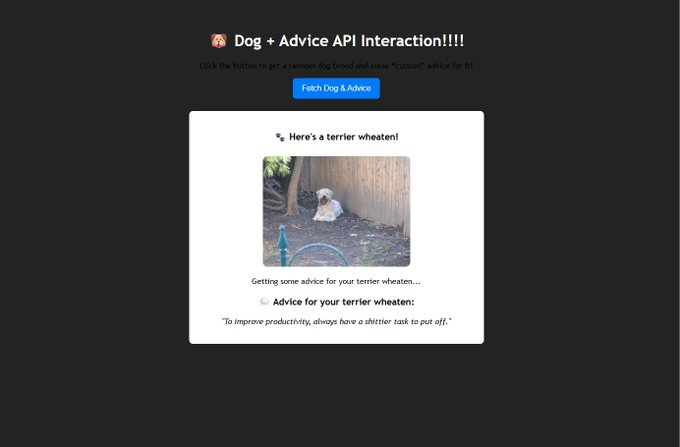

# Fetch Dog Photo & Advice Project!

This project will allow users to fetch a dog photo, the breed of the dog, and also fetch another API to give advice for the dog!

## How It's Made:

**Tech used:**: HTML, CSS, and JavaScript

I used html for the markup, css for the styling, andI used Javascript for the logic of this project.

## Lessons Learned:

I learned how to interact 2 different APIs and output 1 result, and I learned how to get data from an API URL, and use that information on the frontend when the information isn't present in the API. Ex: I took the breed of the dog, from the URL because the APi did not have the corresponding information for the dog breed, that i needed! 

## Image of Project:

